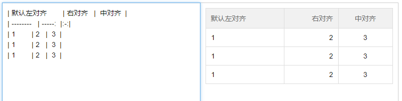

#mdeditor
## 演示地址及API
[http://mdeditor.qinshenxue.com](http://mdeditor.qinshenxue.com)

##更新日志
版本号（x.y.z）说明
- x 有不兼容低版本更新
- y 增加新api、语法
- z 修复bug，优化代码

### V1.2.0
2016-07-02
- 添加版本号及说明
- 增加引用语法`>引用`，引用内支持ul和ol
- 增加斜体语法`*斜体*`
- 增加私有语法插入iframe`$[iframe高度](iframe的src)`比如$\[200](http://mdeditor.qinshenxue.com)
- 优化解析代码

### 2016-05-17 周二
1. 代码段增加对js的高亮显示，目前仅支持js关键字，字符串，注释。类型为\`\`\`javascript

### 2016-05-14 周日
1. 修复CSS代码段对伪类显示的bug

### 2016-05-14 周六
1. 代码段增加对xml的高亮显示
2. 优化CSS，提升阅读体验

### 2016-04-13 周三
1. 修改css样式

### 2016-03-14
1. 修复 粗体语法和无序列表语法冲突bug
2. 修复 图片与其他行内语法并存时其他语法无效 的bug
3. 修改代码块无法自动换行的样式
4. 调整ul、ol的行间距等以增加更好的阅读体验

### 2016-03-02
1. 增加目录结构
2. 修复表格头对齐无效的bug
3. 增加级联滚动

### 2016-02-26
1. 增加gulp构建工具配置

### 2016-01-22
1. 增加table语法（见下方的语法支持效果图）

### 2016-01-19
1. 增加压缩版

### 2016-01-14
1. 更改解析方法，简化代码，提升解析速度。

### 2015-12-08
1. 增加粗体语法
2. 去掉a链接新窗口打开语法（为了和标准保持一致），改为配置项配置，默认aTarget配置为'_blank'
3. 优化部分正则匹配

### 2015-12-04
1. 修复连续多个图片一起时不能正常解析的bug，图片改为用p标签包裹，img标签去掉block样式，改为默认行内样式，允许多个图片一行显示。
2. 修改代码块的样式，改为黑色背景。（注意：整体的css样式自己可以随意修改，改成自己想要的。）
3. 优化了部分正则表达式
4. 添加对css代码（一行展示）的解析

### 2015-11-17
1. 增加css代码的美化

### 2015-11-14
1. 将所有匹配正则从私有变量中提取出来
2. 修复列表和代码块无法识别的bug
3. 修改代码块的样式

### 2015-11-13
1. 增加设置输入框placeholder属性的配置项
2. 增加设置输入框name属性的配置项
3. 优化css代码
4. 修复删除目录语法后，预览还显示目录的bug
5. 完善无序列表的支持语法，包括（. - *）
6. 优化代码块匹配，不加代码类别也可以匹配
7. 优化无序列表和有序列表的匹配方法，采用原生的ul和ol标签包裹

### 2015-11-12
1. 优化标题的匹配正则
2. 新增TOC目录语法

### 2015-11-11
1. 优化css样式代码

### 2015-11-10
1. 增加获取HTML接口`getHTML`
2. 增加获取markdown内容接口`getMarkdown`
3. 增加设置markdown内容接口`setMarkdown`
4. 解决行内代码中带html标签无法正常显示的bug
5. 增加初始化实例的两种场景（传参和不传参数）
6. 优化部分css样式代码

### 2015-11-09
1. 增加a链接新窗口打开语法，见下方gif图演示

## 已支持语法
### 目录

### 标题

### 段落

### 链接

### 列表（无序列表，有序列表）

*****

### 图片

### 行内代码

### 代码块

### 表格
