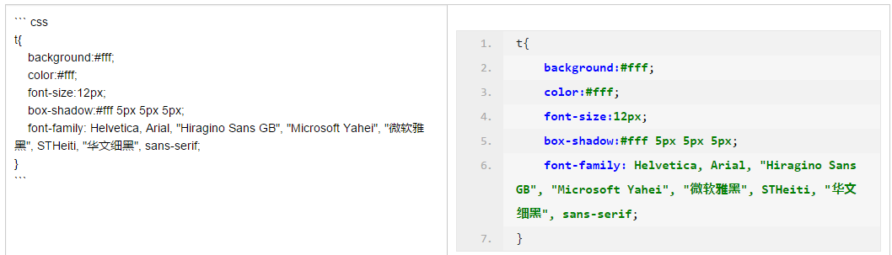
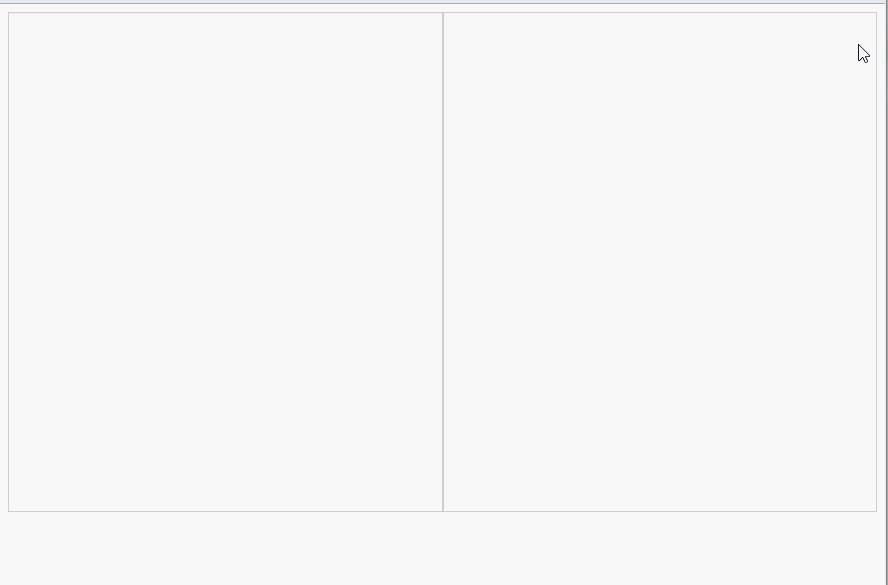
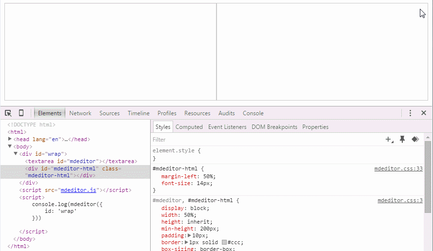
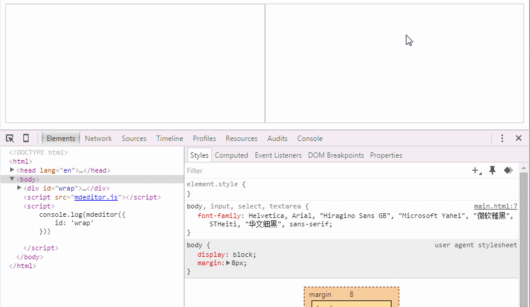
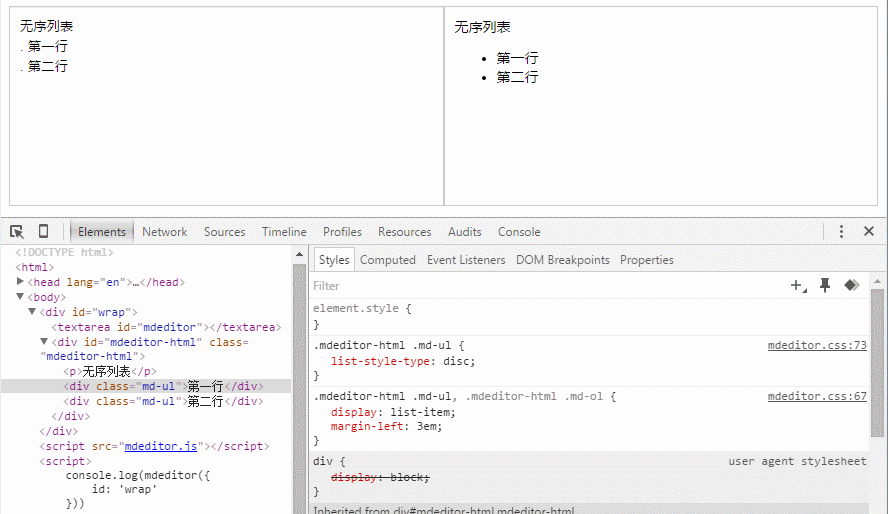
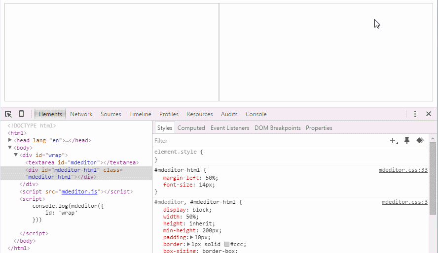
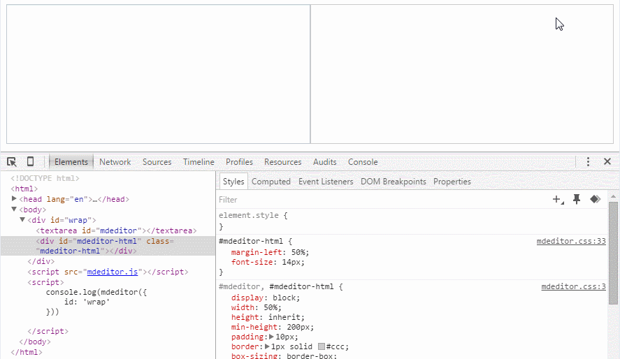
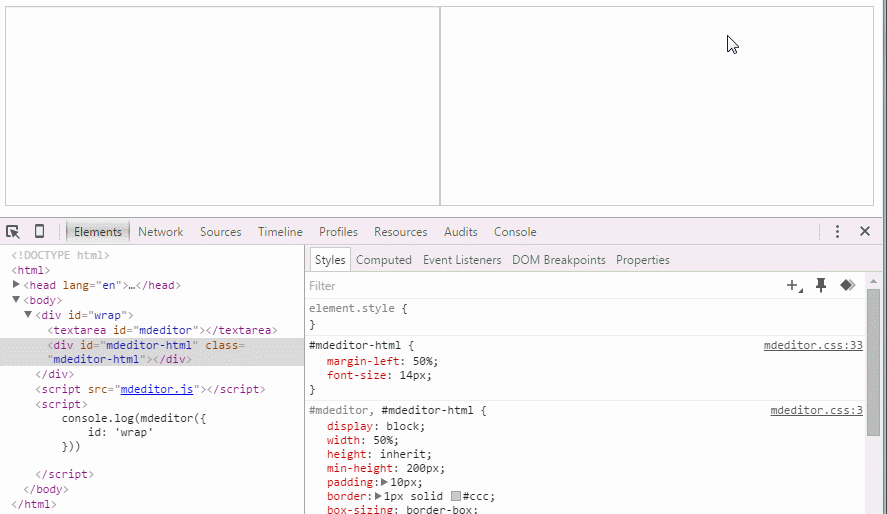

#mdeditor
## 演示地址
[http://www.qinshenxue.com/demo/mdeditor/index.html](http://www.qinshenxue.com/demo/mdeditor/index.html)
## API

### 初始化实例（传入参数id）
```
<div id="wrap">

</div>
<script>
    var mdeditor = mdeditor({
        id: 'wrap'
    });
</script>
```
#### 带参数完整配置项

```
<script>
    var mdeditor = mdeditor({
        id: '容器的id', // 必须的
        name:'输入框name属性值',
        placeholder: '与html5中的placeholder同义，兼容性也相同',
        aTarget: '_blank' // a链接target属性值
    });
</script>
```

### 初始化实例（不传参数）
用于一些只想单独用mdeditor的api的场景
比如要把一些markdown语法文本转义html内容

```
<div id="wrap">

</div>
<script>
    var mdeditor = mdeditor();
    mdeditor.markdownToHtml('#要转义的markdown语法文本');
</script>
```


### getHTML
获取markdown转义后的HTML代码
```
<script>
    var mdeditor = mdeditor({
        id: 'wrap'
    });
    mdeditor.getHTML();
</script>
```

### getMarkdown
获取markdown内容
```
<script>
    var mdeditor = mdeditor({
        id: 'wrap'
    });
    mdeditor.getMarkdown();
</script>
```
### setMarkdown
设置markdown内容
```
<script>
    var mdeditor = mdeditor({
        id: 'wrap'
    });
    mdeditor.setMarkdown('#markdown内容');
</script>
```


##更新日志

### 2015-12-08
1. 增加粗体语法
2. 去掉a链接新窗口打开语法（为了和标准保持一致），改为配置项配置，默认aTarget配置为'_blank'
3. 优化部分正则匹配


### 2015-12-04
1. 修复连续多个图片一起时不能正常解析的bug，图片改为用p标签包裹，img标签去掉block样式，改为默认行内样式，允许多个图片一行显示。
2. 修改代码块的样式，改为黑色背景。（注意：整体的css样式自己可以随意修改，改成自己想要的。）
3. 优化了部分正则表达式
4. 添加对css代码（一行展示）的解析

### 2015-11-17
1. 增加css代码的美化


### 2015-11-14
1. 将所有匹配正则从私有变量中提取出来
2. 修复列表和代码块无法识别的bug
3. 修改代码块的样式


### 2015-11-13
1. 增加设置输入框placeholder属性的配置项
2. 增加设置输入框name属性的配置项
3. 优化css代码
4. 修复删除目录语法后，预览还显示目录的bug
5. 完善无序列表的支持语法，包括（. - *）
6. 优化代码块匹配，不加代码类别也可以匹配
7. 优化无序列表和有序列表的匹配方法，采用原生的ul和ol标签包裹

### 2015-11-12
1. 优化标题的匹配正则
2. 新增TOC目录语法

### 2015-11-11
1. 优化css样式代码

### 2015-11-10
1. 增加获取HTML接口`getHTML`
2. 增加获取markdown内容接口`getMarkdown`
3. 增加设置markdown内容接口`setMarkdown`
4. 解决行内代码中带html标签无法正常显示的bug
5. 增加初始化实例的两种场景（传参和不传参数）
6. 优化部分css样式代码

### 2015-11-09
1. 增加a链接新窗口打开语法，见下方gif图演示


## 已支持语法
### 目录


### 标题

### 段落

### 链接

### 列表（无序列表，有序列表）

*****

### 图片

### 行内代码

### 代码块
