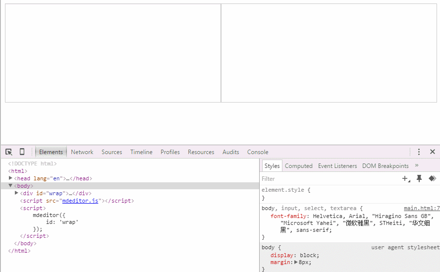

#mdeditor
## 演示地址
[http://www.qinshenxue.com/demo/mdeditor/index.html](http://www.qinshenxue.com/demo/mdeditor/index.html)
## API

### 初始化实例（传入参数id）
```
<div id="wrap">

</div>
<script>
    var mdeditor = mdeditor({
        id: 'wrap'
    });
</script>
```

### 初始化实例（不传参数）
用于一些只想单独用mdeditor的api的场景
比如要把一些markdown语法文本转义html内容

```
<div id="wrap">

</div>
<script>
    var mdeditor = mdeditor();
    mdeditor.markdownToHtml('#要转义的markdown语法文本');
</script>
```


### getHTML
获取markdown转义后的HTML代码
```
<script>
    var mdeditor = mdeditor({
        id: 'wrap'
    });
    mdeditor.getHTML();
</script>
```

### getMarkdown
获取markdown内容
```
<script>
    var mdeditor = mdeditor({
        id: 'wrap'
    });
    mdeditor.getMarkdown();
</script>
```
### setMarkdown
设置markdown内容
```
<script>
    var mdeditor = mdeditor({
        id: 'wrap'
    });
    mdeditor.setMarkdown('#markdown内容');
</script>
```


##更新日志
### 2015-11-11
1. 优化css样式代码

### 2015-11-10
1. 增加获取HTML接口`getHTML`
2. 增加获取markdown内容接口`getMarkdown`
3. 增加设置markdown内容接口`setMarkdown`
4. 解决行内代码中带html标签无法正常显示的bug
5. 增加初始化实例的两种场景（传参和不传参数）
6. 优化部分css样式代码

### 2015-11-09
1. 增加a链接新窗口打开语法，见下方gif图演示


## 已支持语法
### 标题

### 段落

### 链接

*****

### 列表（无序列表，有序列表）

*****

### 图片

### 行内代码

### 代码块
